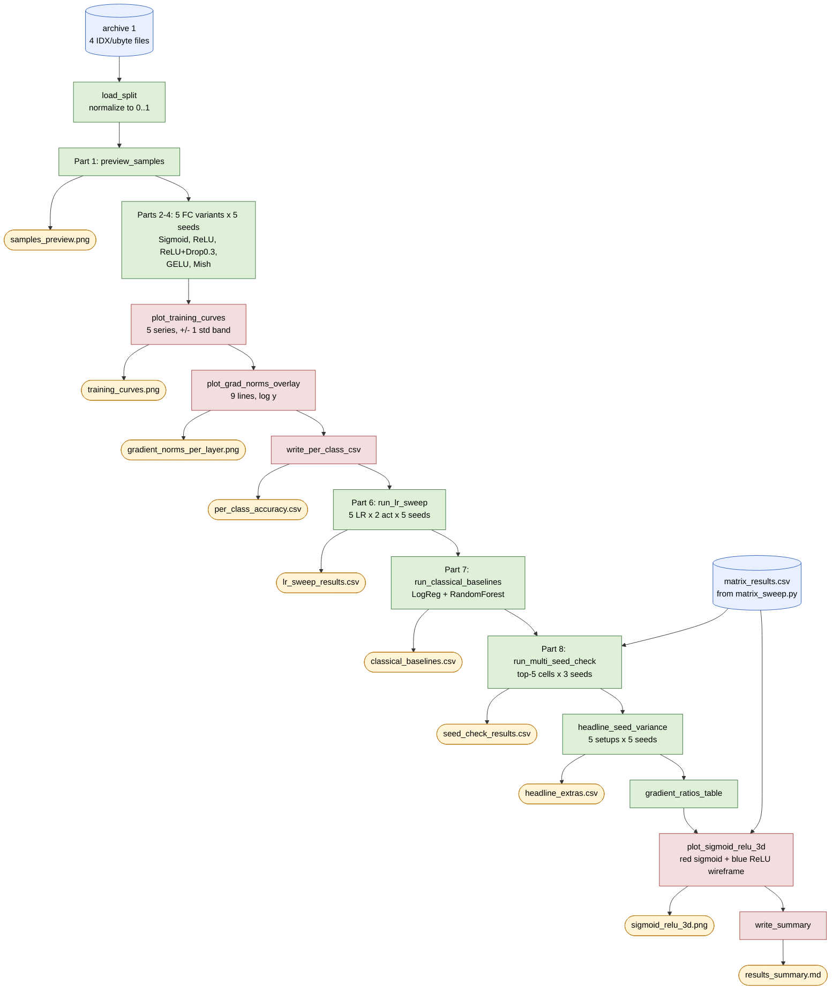
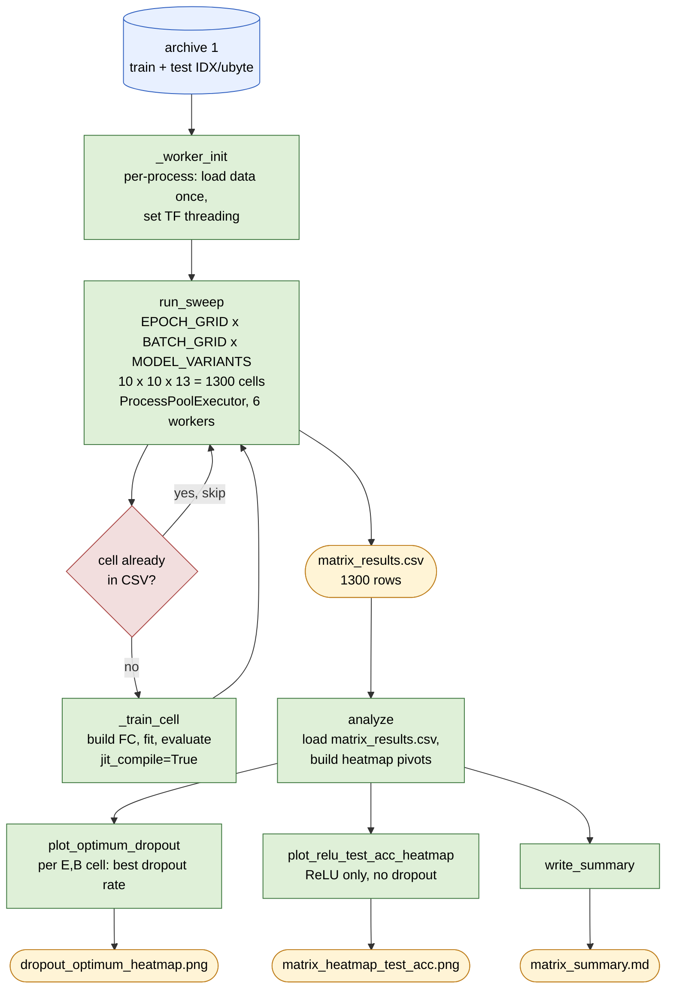
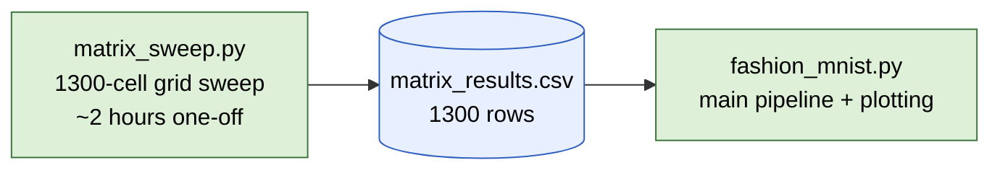

# Project flow: fashion_mnist.py and matrix_sweep.py

Two scripts, one assignment, one shared dataset. The assignment-mapping
table shows which Part of the brief each function answers; the flowcharts
show data and asset flow.

## Assignment mapping

| Assignment item | Script | Function |
|---|---|---|
| Part 1: Read data, train/test split, view images | `fashion_mnist.py` | `load_split`, `preview_samples` |
| Part 2: Sigmoid + SGD + cross-entropy, E=10/B=1000 | `fashion_mnist.py` | `build_fc('sigmoid')` + `run_fc_multi_seed` |
| Part 3a: Replace sigmoid with ReLU | `fashion_mnist.py` | `build_fc('relu')` + `run_fc_multi_seed` |
| Part 3b: Add Dropout(0.3) | `fashion_mnist.py` | `build_fc('relu', dropout=0.3)` + `run_fc_multi_seed` |
| Modern smooth activations | `fashion_mnist.py` | `build_fc('gelu')`, `build_fc('mish')` |
| Learning-rate sensitivity (sigmoid + ReLU, 5 seeds) | `fashion_mnist.py` | `run_lr_sweep` |
| Classical baselines | `fashion_mnist.py` | `run_classical_baselines` |
| Multi-seed top-5 sanity check | `fashion_mnist.py` | `run_multi_seed_check` (reads `matrix_results.csv`) |
| Headline seed variance (5 setups x 5 seeds) | `fashion_mnist.py` | `headline_seed_variance` |
| Gradient-flow diagnostic | `fashion_mnist.py` | `GradNormCallback` + `plot_grad_norms_overlay` |
| 3D wireframe overlay (sigmoid vs ReLU) | `fashion_mnist.py` | `plot_sigmoid_relu_3d` (reads `matrix_results.csv`) |
| 1300-cell (E x B x model) grid sweep | `matrix_sweep.py` | `run_sweep`, `analyze` |

## fashion_mnist.py

Vertical execution order (matches `main()` line by line). Outputs branch
off to the right of each step.



## matrix_sweep.py



## How the two scripts relate

`matrix_sweep.py` runs once and produces a 1300-row CSV. `fashion_mnist.py`
reads that CSV in two places: Part 8's multi-seed top-5 sanity check (which
retrains the five highest-accuracy cells on extra seeds), and the 3D
wireframe overlay (which pivots the sigmoid and ReLU rows into surfaces).



## Render to PNG for Word

Mermaid renders inline on GitHub and in VS Code preview. For an
embedded PNG in the Word document:

```powershell
npm install -g @mermaid-js/mermaid-cli
mmdc -i flowchart.md -o flowchart.png -w 1600 -H 2400
```

Or paste the Mermaid block alone into [mermaid.live](https://mermaid.live)
and export PNG / SVG from there.
